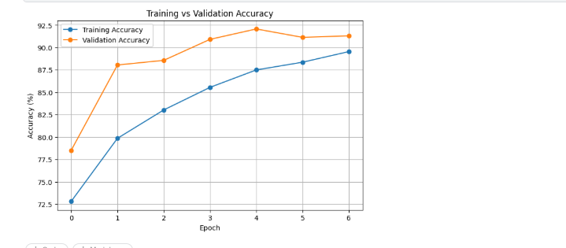
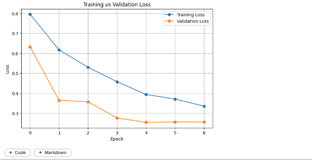
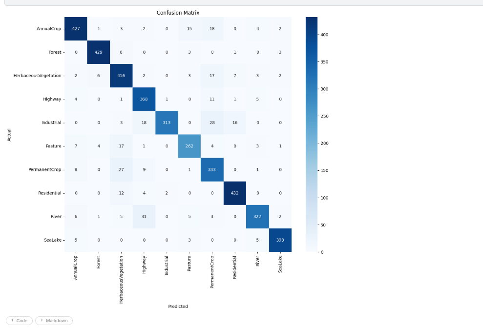
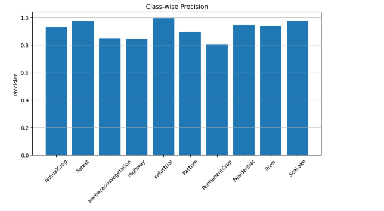
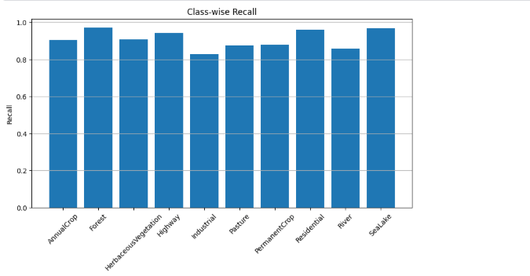
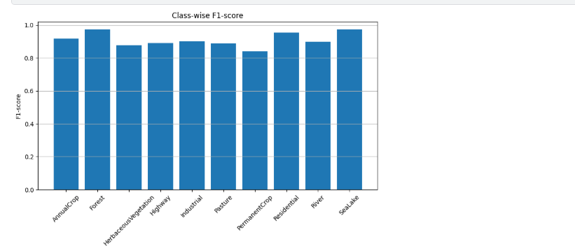

# Enhanced ResNet39: Lightweight Residual CNN for EuroSAT Land Cover Classification

A custom lightweight residual convolutional neural network built from scratch in PyTorch for satellite image classification on the EuroSAT dataset. Achieves **91.23% accuracy** with only **2.25M parameters** — outperforming pretrained ResNet18 while using ~60x fewer parameters than pretrained VGG16.

---

## Results

| Model | Accuracy | Parameters |
|---|---|---|
| VGG16 (ImageNet Pretrained) | 94.12% | ~134M |
| **Enhanced ResNet39 (Custom)** | **91.23%** | **2.25M** |
| ResNet18 (ImageNet Pretrained) | 77.09% | ~11.7M |

> Custom model trained from scratch — no pretrained weights used.

---

## Result Visualizations

### Accuracy & Loss Curves



### Confusion Matrix


### Per-Class Metrics




---

## Dataset

- **EuroSAT RGB** — Sentinel-2 satellite imagery
- **10 land cover classes**: AnnualCrop, Forest, HerbaceousVegetation, Highway, Industrial, Pasture, PermanentCrop, Residential, River, SeaLake
- **27,000 images** total, 64×64 pixels
- Download: [EuroSAT on Kaggle](https://www.kaggle.com/datasets/apollo2506/eurosat-dataset)

---

## Model Architecture

A custom 39-layer residual network built from scratch with 3-convolution residual blocks.

```
Input (3 × 64 × 64)
    │
    ▼
Conv2d (3 → 32, 3×3) + BN + ReLU
    │
    ▼
ResidualBlock × 2  (32 filters)
    │
    ▼
ResidualBlock × 2  (64 filters, stride=2)
    │
    ▼
ResidualBlock × 2  (128 filters, stride=2)
    │
    ▼
AdaptiveAvgPool2d → Flatten
    │
    ▼
FC(128 → 256) + ReLU + Dropout(0.5)
    │
    ▼
FC(256 → 10) → Output
```

Each ResidualBlock contains: `Conv → BN → ReLU → Conv → BN → ReLU → Conv → BN + skip → ReLU`

**Total Parameters: 2,248,490 (~2.25M)**

---

## Training Details

| Setting | Value |
|---|---|
| Framework | PyTorch |
| Image Size | 64 × 64 |
| Batch Size | 32 |
| Epochs | 7 |
| Loss Function | CrossEntropyLoss |
| Optimizer | Adam |
| Learning Rate | 0.001 |
| Weight Decay | 1e-4 |
| LR Scheduler | StepLR (step=7, γ=0.1) |
| Weight Init | Kaiming (He) |
| Regularization | Dropout (0.5) |
| Hardware | Kaggle Tesla T4 (~14.56 GB VRAM) |

---

## Project Structure

```
EuroSAT-Land-Cover-Classification/
├── README.md
├── requirements.txt
├── notebook.ipynb
└── results/
    ├── accuracy_curve.png
    ├── loss_curve.png
    ├── confusion_matrix.png
    ├── precision.png
    ├── recall.png
    └── f1_score.png
```

---

## Setup & Usage

```bash
git clone https://github.com/AyushJha004/EuroSAT-Land-Cover-Classification.git
cd EuroSAT-Land-Cover-Classification
pip install -r requirements.txt
```

Open `notebook.ipynb` in Jupyter or upload directly to Kaggle/Colab to run.

> Download the EuroSAT dataset from [Kaggle](https://www.kaggle.com/datasets/apollo2506/eurosat-dataset) and update the dataset path in the notebook.

---

## Key Takeaway

This project demonstrates that a well-designed lightweight custom architecture can closely match the performance of large pretrained models while being significantly more parameter-efficient — making it suitable for resource-constrained environments.
